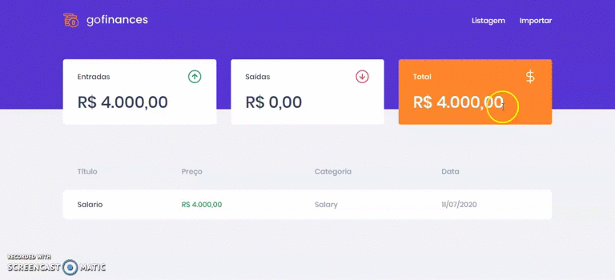

# GO-Finances
Projeto do desafio 7 do curso GoStack 12

* Esse desafio consiste em continuar desenvolvendo a aplicação de gestão de transações, a GoFinances 
mas agora com a interface pois o backend já está pronto.

### Funcionalidades da aplicação

* Listar as transações da sua API: Sua página Dashboard deve ser capaz de exibir uma listagem através de uma tabela, com o campo title, value, type e category de todas as transações que estão cadastradas na sua API.

* Exibir o balance da sua API: Sua página Dashboard, você deve exibir o balance que é retornado do seu backend, contendo o total geral, junto ao total de entradas e saídas.

* Importar arquivos CSV: Na sua página Import, você deve permitir o envio de um arquivo no formato csv para o seu backend, que irá fazer a importação das transações para o seu banco de dados. O arquivo csv deve seguir o seguinte modelo.

